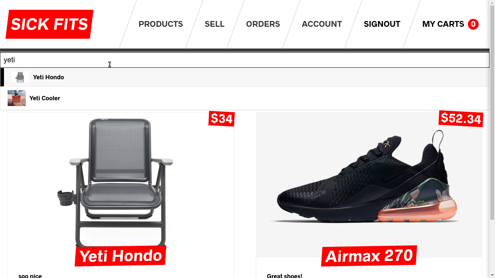
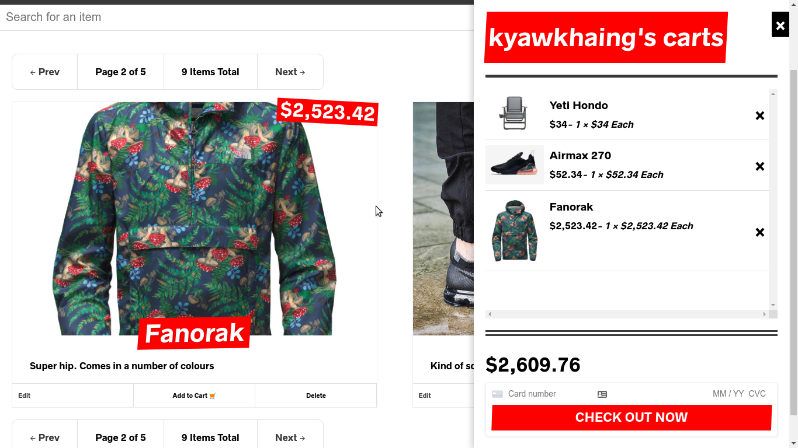
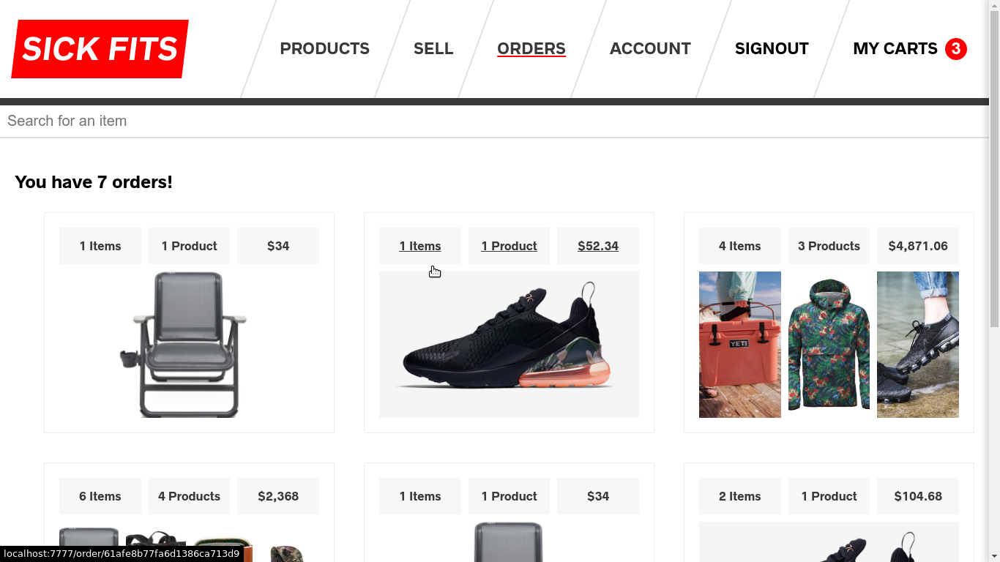

<!-- PROJECT LOGO -->
 

  <h3 align="center">Sick Fits (Next.js E-commerce)</h3>

  

    <a href="">View Demo</a>
  

<!-- ABOUT THE PROJECT -->

## About The Project

**Sick Fits (Next.js E-commerce)** is an example online shop built with React.js(Nextjs), GraphQL, and Keystone.js.

### Built With

#### FrontEnd

- [Next.js for server side rendering, routing and tooling](https://nextjs.org/) (React.js framework)
- [Typescript](https://www.typescriptlang.org/) with `strict:true`
- [Styled Components for styling](https://styled-components.com/)
- [Jest & React Testing Library for Testing](https://jestjs.io/)
- [Debounced Product Search with DownshiftJS](https://github.com/downshift-js/downshift)
- Custom Form Hook For Form validation

#### [Apollo Client](https://www.apollographql.com/) (For Data Management)

- Fetching data via GraphQL Queries
- Caching GraphQL Data
- Apollo Client replaces the need for redux + data fetching/caching libraries

#### [Keystone.js](https://www.keystonejs.com/) (Backend)

- Admin Interface to manage data
- Provides a set of GraphQL CRUD APIs for a MongoDB or Prisma Database
- Implementing Custom GraphQL Query and Mutation Resolvers
- Charging Credit Cards with [Stripe](https://stripe.com/)
- Sending Email
- Performing Authentication
- Managing + Checking Roles + Permissions

<!-- ROADMAP -->

## Screenshots

You can find more screenshots in the [screenshot/](screenshot/) folder.

### Home Page

### Checkout Page

### Order Page

## To-Do List

- [ ] Implement Unit Tests
- [ ] Setup CI/CD pipeline with CircleCI/Docker-Compose
